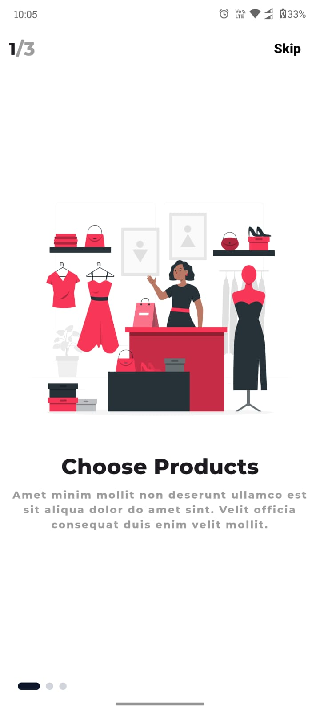
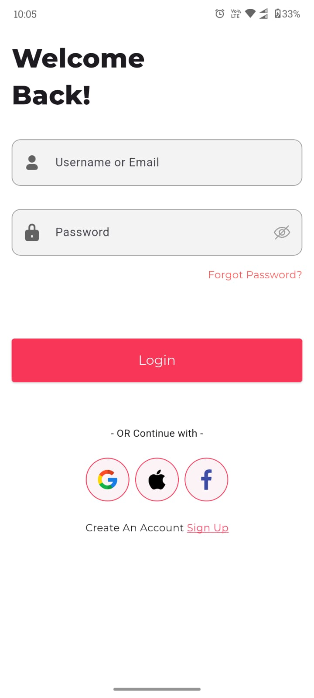
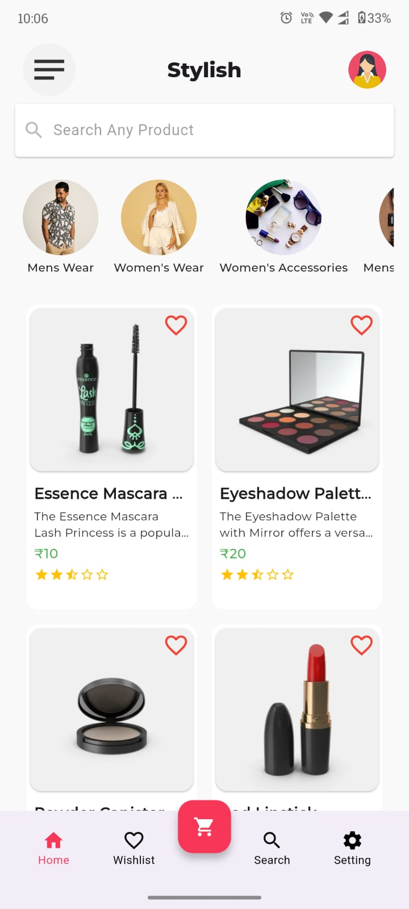
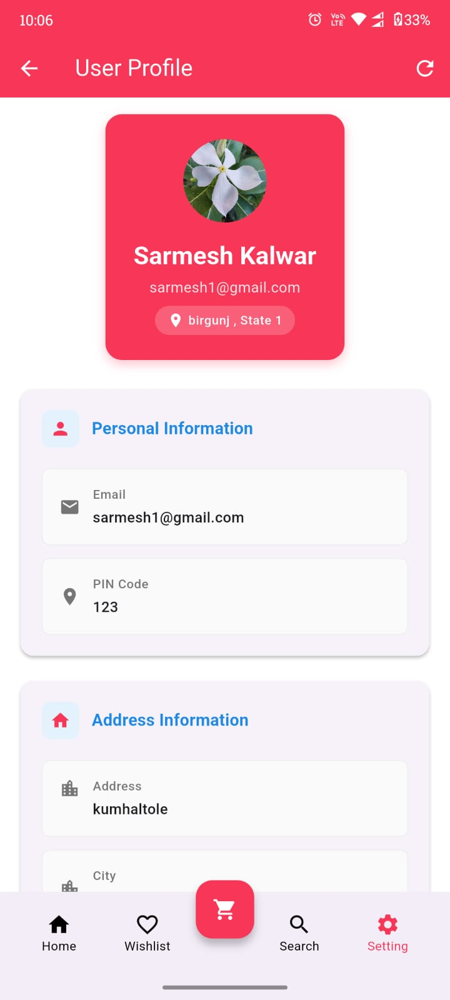
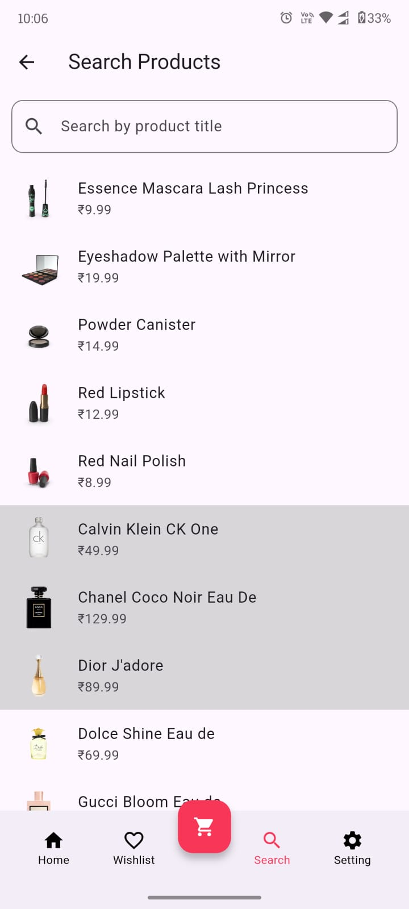
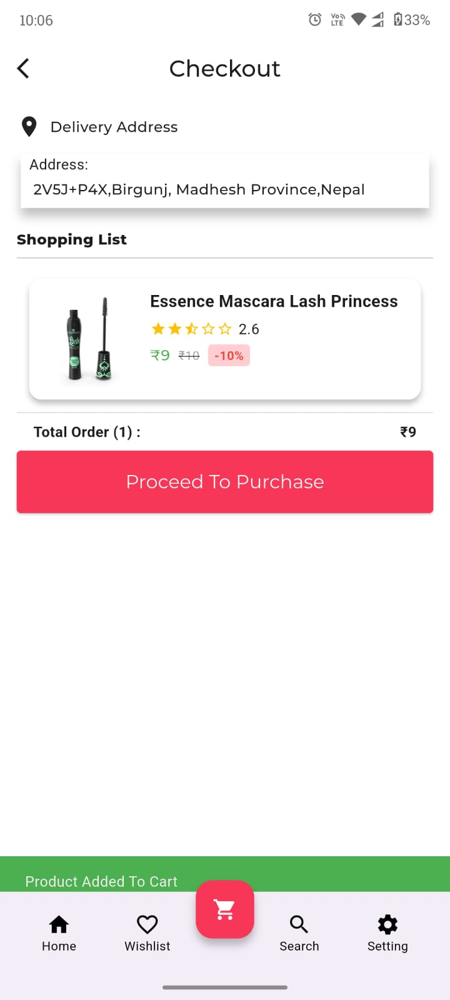

# 🛍️ Stylish – Flutter E-commerce App

A beautiful and fully functional **multiplatform e-commerce app** built using **Flutter**, with complete backend integration and user authentication via **Firebase**.

  
  
  
    
  
  

## ✨ Features

- 🔐 **Firebase Authentication** (Email/Password)
- 🧠 **Firebase Realtime Database** for storing user info
- 📦 **Product listing** powered by [DummyJSON API](https://dummyjson.com/)
- 📱 Beautiful and responsive **UI design**
- 🔁 Seamless navigation and intuitive user experience
- 🧩 Designed for scalability and clean code architecture

## 🚀 Getting Started

Clone the repository:

\`\`\`bash
git clone https://github.com/yourusername/stylish.git
cd stylish
flutter pub get
flutter run
\`\`\`

## 🛠️ Tech Stack

- **Flutter**
- **Firebase Authentication**
- **Firebase Realtime Database**
- **Provider / Riverpod / BLoC** (mention state management if used)
- **REST API** integration (DummyJSON)

## 🧑‍💻 Author

Developed with ❤️ by  Sarmesh Kalwar
